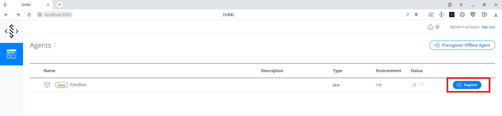
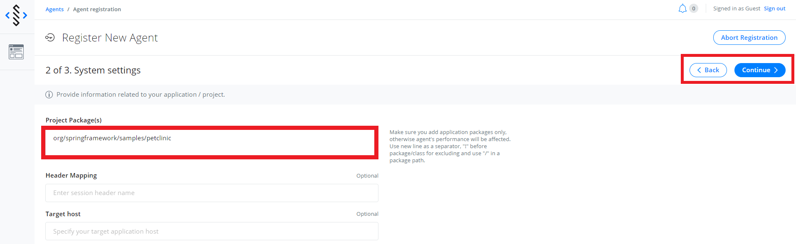
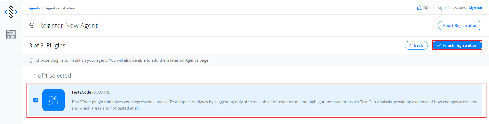

# Drill-Maven-Samples

## Preparation

1. <a href="https://www.docker.com/products/docker-desktop">Download docker</a>
2. Download actual version of drill agent for your OS
    1. <a href="https://oss.jfrog.org/artifactory/oss-release-local/com/epam/drill/drill-agent-mingwX64/">Windows</a>
    2. <a href="https://oss.jfrog.org/artifactory/oss-release-local/com/epam/drill/drill-agent-linuxX64/">Linux</a>
    3. <a href="https://oss.jfrog.org/artifactory/oss-release-local/com/epam/drill/drill-agent-macosX64/">MacOS</a>
3. Unzip it    
4. Go to folder /maven-sample/spring-petclinic in pom.xml file set value to "pathToAgent" property
## Start and register app
1. Launch docker
2. Go to folder /admin and click on "start-docker-comose.bat" file
3. Lauch "spring-petclinic" application 
    1. cmd to /maven-sample/spring-petclinic and write ```mvnw spring-boot:run```
    2. or in idea run maven task spring-boot:run
4. When the application is launched follow the link http://localhost:3000 and register the agent
    1. Register agent 
    2. Set package 
    3. Add test2code plugin 
    
## Start Autotests

1. Cmd to one of autotest repositories
2. ```mvnw test```
3. or in idea run "test" task

